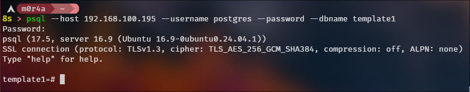
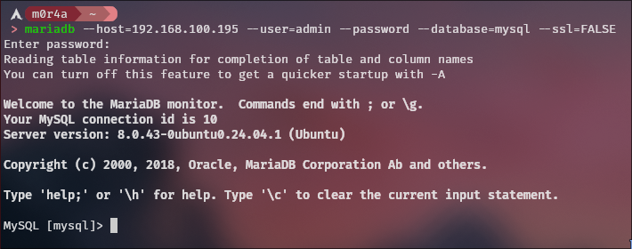

Este es mi write up de cómo instalo, configuro, y administro las DBs `PostgreSQL` y `MySQL`

Para ambas pruebas se utilizó Ubuntu Server y su [documentación oficial](https://documentation.ubuntu.com/server/how-to/databases/)

# Tabla de Contenidos

- [PostgreSQL](#postgresql)
  - [Instalación](#instalación)
  - [Configuración](#configuración)
     - [Permitiendo conexiones externas](#permitiendo-conexiones-externas)
     - [Configurando el usuario `postgres`](#configurando-el-usuario-postgres)
     - [Arreglando que el puerto no se está abriendo](#arreglando-que-el-puerto-no-se-está-abriendo)
     - [Conectándome a la db](#conectándome-a-la-db)
    - [Creando una DB y usuarios](#creando-una-db-y-usuarios)
     - [Configuración de memoria y recursos](#configuración-de-memoria-y-recursos)
     - [Logging para monitoreo](#logging-para-monitoreo)
     - [Configuración de Write-Ahead Log (WAL)](#configuración-de-write-ahead-log-wal)
     - [Script de backups](#script-de-backups)
- [MySQL](#mysql)
  - [Instalación](#instalación-1)
  - [Configuración](#configuración-1)
    - [Configuración inicial de seguridad](#configuración-inicial-de-seguridad)
    - [Permitiendo conexiones externas](#permitiendo-conexiones-externas-1)
    - [Configurando usuarios](#configurando-usuarios)
    - [Conectándome a la db](#conectándome-a-la-db-1)
    - [Creando una DB y usuarios](#creando-una-db-y-usuarios-1)
    - [Configuración de memoria y recursos](#configuración-de-memoria-y-recursos-1)
    - [Logging para monitoreo](#logging-para-monitoreo-1)
    - [Configuración de Binary Log](#configuración-de-binary-log)
    - [Script de backups](#script-de-backups-1)


# PostgreSQL

Esto se va a hacer basado en [la documentación de Ubuntu Server para instalar PostgreSQL](https://documentation.ubuntu.com/server/how-to/databases/install-postgresql/) y [la documentación de PostgreSQL 16.10](https://www.postgresql.org/docs/16/index.html)

## Instalación

Bastante básico, simplemente

```bash
sudo apt install postgresql
```

## Configuración

### Permitiendo conexiones externas

1. En mi caso estoy creando la DB en una VM así que dentro de `/etc/postgresql/*/main/postgresql.conf` voy a agregar la IP de la interfaz puente entre la VM y mi computadora.

```
listen_addresses = 'localhost, 192.168.100.195'
```

2. Y reinicio el servicio.

```bash
sudo systemctl restart postgresql
```

### Configurando el usuario `postgres`

1. Conectarse a la base de datos `template1` como el usuario postgres.

```bash
sudo -u postgres psql template1
```

2. Ahora hay que cambiar la contraseña del usuario

```sql
ALTER USER postgres with encrypted password 'la_contraseña';
```

3. Después hay que configurar el archivo `/etc/postgresql/*/main/pg_hba.conf`

```
hostssl       template1  postgres  192.168.100.1/24  scram-sha-256  [OPTIONS]
```

> Esto tiene un error, el [OPTIONS] no debería estar pero esto se explica en la siguiente sección.

4. Reiniciar el servicio:

```bash
sudo systemctl restart postgresql.service
```

> Aquí le agregué el `.service` se puede usar de forma indistinta a menos de que haya algo como postgresql.socket por ejemplo


### Arreglando que el puerto no se está abriendo

Al intentar conectarme desde mi computadora a la db me dió error, fui a la VM que la tiene y vi que el puerto no se abría aunque reiniciara el servicio, lo verifiqué con:

```bash
ss -lntp | grep 5432
```

1. Entonces revisé el estado del servicio

```bash
sudo systemctl status postgresql
```

Y dice que está `Active (exited)` lo que significa que ejecutó un script y salió así que no es el servicio real que se ejecuta en segundo plano 

2. Me puse a revisar los logs del servicio postgresql

```bash
journalctl -u postgresql -e
```

Pero no me dió nada importante:

```
Sep 03 01:38:25 db-server systemd[1]: Starting postgresql.service - PostgreSQL RDBMS...
Sep 03 01:38:25 db-server systemd[1]: Finished postgresql.service - PostgreSQL RDBMS.
Sep 03 01:40:55 db-server systemd[1]: postgresql.service: Deactivated successfully.
Sep 03 01:40:55 db-server systemd[1]: Stopped postgresql.service - PostgreSQL RDBMS.
Sep 03 01:40:55 db-server systemd[1]: Stopping postgresql.service - PostgreSQL RDBMS...
Sep 03 01:40:55 db-server systemd[1]: Starting postgresql.service - PostgreSQL RDBMS...
Sep 03 01:40:55 db-server systemd[1]: Finished postgresql.service - PostgreSQL RDBMS.
```

3. Así que decidí revisar directamente el archivo del servicio a ver si había información

```bash
sudo systemctl cat postgresql
```

Esto es lo más relevante:

```
# The unit actually managing PostgreSQL clusters is postgresql@.service,
# instantiated as postgresql@15-main.service for individual clusters.
```

Revisé `postgresql@` y no hay nada, revisé el `postgresql@15-main` por probar y pues no había nada, ya suponía que revisar el `16-main`.

4. Al fin tengo información, esto fué lo que me dió el comando:

```bash
sudo systemctl status postgresql@16-main
```

Lo importante es esto:

```
CONTEXT:  line 19 of configuration file "/etc/postgresql/16/main/pg_hba.conf"
```

5. Conclusión

Al configurar el usuario de postgres en el punto 3 debí haber quitado el `[OPTIONS]`

### Conectándome a la db

```bash
psql --host 192.168.100.195 --username postgres --password --dbname template1
```

<p align="center">
    
</p>

### Creando una DB y usuarios

1. Crear los usuarios

```sql
CREATE ROLE app_user WITH LOGIN PASSWORD 'una_contraseña';
CREATE ROLE readonly_user WITH LOGIN PASSWORD 'secure_password';
```

2. Crear la base de datos

```sql
CREATE DATABASE app_db OWNER app_user;
```

3. Configurar los permisos

```sql
GRANT CONNECT ON DATABASE app_db TO readonly_user;  -- Dar permiso de conectarse
GRANT USAGE ON SCHEMA public TO readonly_user;  -- Dar permiso para ver el esquema "public"
GRANT SELECT ON ALL TABLES IN SCHEMA public TO readonly_user;  -- Permitir al usuario hacer consultas SELECT en el esquema público
```

y con esto tenemos al usuario `app_user` que es dueño de la db `app_db` y al usuario `readonly_user` que tiene permiso de leer el esquema `public` de la db de `app_user`.

### Configuración de memoria y recursos

en `/etc/postgres/*/main/postgresql.conf`

```
# La VM que tiene la DB tiene 4GB de RAM
shared_buffers = '1GB'          # 25% de RAM total
effective_cache_size = '3GB'      # 50-75% de RAM total
work_mem = '32MB'
maintenance_work_mem = '256MB'
```

### Logging para monitoreo

```
logging_collector = on
log_directory = 'log'
log_filename = 'postgresql-%Y-%m-%d_%H%M%S.log'
log_rotation_age = 1d
log_rotation_size = 100MB
log_line_prefix = '%m [%p] %q%u@%d '
log_min_duration_statement = 1000 
log_statement = 'ddl'
#log_statement = 'all'           # Solo para desarrollo
```

### Configuración de Write-AHead Log (WAL)

WAL es un sistema de registro que ayuda con la durabilidad y consistencia de los datos. Al haber un cambio en la base de datos esto se escribe en un fichero WAL antes de realmente aplicarse.

1. Crear los directorios:

```
sudo mkdir -p /var/lib/postgresql/archive
sudo chown postgres:postgres /var/lib/postgresql/archive
```

2. En `/etc/postgresql/*/main/postgresql.conf`

```
wal_level = replica
archive_mode = on
archive_command = 'cp %p /var/lib/postgresql/archive/%f'
max_wal_senders = 0
```

- `wal_level`
    - `minimal`: solo contiene lo necesario para recuperarse tras un crash. No permite PITR ni replicación.
    - `replica`: permite PITR y replicación. Es el más común.
    - `logical`: tiene más detalle y con este puedes hacer **replicación lógica** (como replicar solo ciertas tablas).
- `archive_mode`
    - `off`:  No archiva WAL. Solo crash recovery.
    - `on`: Archiva WAL al **cerrar** segmentos (este es el estandar).
    - `always`: Archiva incluso segmentos usados por réplica en streaming. Útil si se necesita **garantizar copias** sin depender de réplicas.
- `archive_command`
    - Este es el comando que se ejecuta cuando un segmento WAL está listo para archivarse.
    - También se puede usar `rsync -a %p <ruta>/%f` en lugar de sólo cp.
- `max_wal_senders`
    - Es el número máximo de procesos que pueden enviar WAL a réplicas.
    - Solo es importante si hay servidores secundarios (standby).

Entonces:

- Si solo quieres **PITR sin réplicas** se usa:
    - `wal_level = replica`
    - `archive_mode = on`
    - `archive_command = (comando que copie a un disco o almacenamiento)`

- Si se necesita **replicación lógica** entonces:
    - `wal_level = logical`

- Si solo se requiere un **crash recovery básico**:
    - `wal_level = minimal`
    - `archive_mode = off`

### Script de backups

```bash
#!/bin/bash
# /usr/local/bin/pg_backup.sh

# Si cualquier comando falla todo el script falla
set -euo pipefail

# Configuración
BACKUP_DIR="/var/backups/postgresql"
DATE=$(date +%Y%m%d_%H%M%S)
RETENTION_DAYS=7
LOG_FILE="/var/log/pg_backup.log"
DB_USER="postgres"

log() {
    echo "[$(date '+%Y-%m-%d %H:%M:%S')] $1" | tee -a "$LOG_FILE"
}

# Crear los directorios necesarios si no existen
mkdir -p "$(dirname "$LOG_FILE")"
mkdir -p "$BACKUP_DIR"

log "Iniciando el backup de PostgreSQL"

# Hacer el backup con compresión
BACKUP_FILE="$BACKUP_DIR/full_backup_$DATE.sql.gz"

if pg_dumpall -U "$DB_USER" | gzip > "$BACKUP_FILE"; then

    chmod 600 "$BACKUP_FILE"

    # verificar si el archivo se creó y tiene algo
    if [[ -s "$BACKUP_FILE" ]]; then
        BACKUP_SIZE=$(du -h "$BACKUP_FILE" | cut -f1)
        log "Backup completada de forma exitosa: $BACKUP_FILE ($BACKUP_SIZE)"
        
        # Limpiar backups antiguos
        DELETED=$(find "$BACKUP_DIR" -name "*.sql.gz" -mtime +$RETENTION_DAYS -delete -print | wc -l)
        log "$DELETED copias de seguridad antiguas eliminadas"
    else
        log "ERROR: El archivo de la copia de seguridad está vacío o no fue creado"
        exit 1
    fi
else
    log "ERROR: Falló el comando pg_dumpall"
    exit 1
fi

log "Proceso de backup completado"
```

#### Consideraciones del script:

1. Los permisos del script deben ser los siguientes:

```
chmod 700 /usr/local/bin/pg_backup.sh
chown postgres:postgres /usr/local/bin/pg_backup.sh
```

Ya que si se vulnera un script que esté en el crontab se pueden ejecutar cosas en nombre del usuario que ejecute ese job.

2. Se debe configurar un método de configuración, ya sea un `.pgpass`

```bash
# Crear el archivo y su contenido
sudo mkdir -p /etc/postgresql/auth
sudo cat > /etc/postgresql/auth/.pgpass << 'EOF'
localhost:5432:db_seleccionada:postgres:contraseña
EOF

sudo chmod 600 /etc/postgresql/auth/.pgpass
sudo chown postgres:postgres /etc/postgresql/auth/.pgpass

# Configurar archivo de password en el .bashrc del usuario postgres
export PGPASSFILE="/etc/postgresql/auth/.pgpass"
```

O modifical el `pg_hba.conf` para permitir la autentacación por usuario del sistema:

```
local all postgres peer
```

3. Este script está pensado para ser ejecutado por el usuario `postgres`

```bash
sudo -u postgres crontab -e
```

Y la entry es la siguiente:

```
# Backups lunes, miércoles y viernes
0 2 * * 1,3,5 /usr/local/bin/pg_backup.sh
```

4. Esto puede ser más completo, enviar correos si el backup falla y demás pero no quiero hacer que este README tenga 1300 líneas.

# MySQL

Esto se va a hacer basado en [la documentación de Ubuntu Server para instalar MySQL](https://documentation.ubuntu.com/server/how-to/databases/install-mysql/) y [la documentación oficial de MySQL 8.0](https://dev.mysql.com/doc/refman/8.0/en/)

## Instalación

```bash
sudo apt install mysql-server
```

## Configuración

### Configuración inicial de seguridad

Aquí hay dos formas de hacer esto, con un script que ya viene con mysql o a mano, haré ambos

1. Utilizando el script

```bash
sudo mysql_secure_installation
```

Este script va a:
- Configurar el plugin de validación de contraseñas
- Cambiar la contraseña de root
- Eliminar usuarios anónimos
- Deshabilitar el acceso remoto de root
- Eliminar la base de datos de prueba

2. Pero también se puede hacer de forma manual

```bash
sudo mysql
```

```sql
-- Cambiar contraseña de root
ALTER USER 'root'@'localhost' IDENTIFIED WITH mysql_native_password BY '<tu_contraseña_segura>';

-- Eliminar usuarios anónimos
DELETE FROM mysql.user WHERE User='';

-- Eliminar acceso remoto de root
DELETE FROM mysql.user WHERE User='root' AND Host NOT IN ('localhost', '127.0.0.1', '::1');

-- Eliminar base de datos de prueba
DROP DATABASE IF EXISTS test;
DELETE FROM mysql.db WHERE Db='test' OR Db='test_%';

-- Recargar privilegios
FLUSH PRIVILEGES;
```

### Permitiendo conexiones externas

1. En `/etc/mysql/mysql.conf.d/mysqld.cnf` cambiar la línea:

```
bind-address = 127.0.0.1
```

Por:

```
bind-address = 192.168.100.195
```

> También se podría usar `0.0.0.0` y bloquear por firewall.

2. Reiniciar el servicio:

```bash
sudo systemctl restart mysql
```

3. Verificar que el puerto está abierto:

```bash
ss -lntp | grep 3306
```

### Configurando usuarios

Voy a crear algunos usuarios para las conexiones remotas

```bash
sudo mysql
```

```sql
-- Usuario para conexiones locales y remotas
CREATE USER 'admin'@'192.168.100.1' IDENTIFIED BY 'contraseña_segura';
GRANT ALL PRIVILEGES ON *.* TO 'admin'@'%' WITH GRANT OPTION;

-- Usuario específico para una IP
CREATE USER 'app_user'@'192.168.100.%' IDENTIFIED BY 'otra_contraseña';
```

### Conectándome a la db

```bash
mariadb --host=192.168.100.195 --user=admin --password --database=mysql
```

Al hacer esto me encontré con este error:

```
Enter password: 
ERROR 2026 (HY000): TLS/SSL error: self-signed certificate in certificate chain
```

Así que aquí tengo 3 opciones:

1. Deshabilitar SSL
2. Autofirmar un certificado y permitirlo
3. Configurar un cetificado dado por una autoridad de certificados

Para este write-up solo voy a quitar SSL.

En `/etc/mysql/mysql.conf.d/mysqld.cnf`

```
[mysqld]
# Deshabilitar SSL completamente
ssl = 0

# Así se configurarían los certificados
# ssl-ca = /etc/mysql/ssl/ca-cert.pem
# ssl-cert = /etc/mysql/ssl/server-cert.pem
# ssl-key = /etc/mysql/ssl/server-key.pem
```

Y por último me conecto sin SSL:

```bash
mariadb --host=192.168.100.195 --user=admin --password --database=mysql --ssl=FALSE
```

<p align="center">
    
</p>

### Creando una DB y usuarios

0.

```bash
sudo mysql
```

1. Crear la base de datos

```sql
CREATE DATABASE app_db CHARACTER SET utf8mb4 COLLATE utf8mb4_unicode_ci;
```

2. Crear los usuarios

```sql
CREATE USER 'app_user'@'%' IDENTIFIED BY 'app_password';
CREATE USER 'readonly_user'@'%' IDENTIFIED BY 'readonly_password';
```

3. Configurar los permisos

```sql
-- Usuario principal con todos los privilegios en la DB
GRANT ALL PRIVILEGES ON app_db.* TO 'app_user'@'%';

-- Usuario de solo lectura
GRANT SELECT ON app_db.* TO 'readonly_user'@'%';

-- Aplicar cambios
FLUSH PRIVILEGES;
```

4. Verificar los usuarios

```sql
SELECT User, Host FROM mysql.user;
SHOW GRANTS FOR 'app_user'@'%';
```

### Creando una DB y usuarios

1. Crear la base de datos:

```sql
CREATE DATABASE app_db CHARACTER SET utf8mb4 COLLATE utf8mb4_unicode_ci;
```

2. Crear los usuarios:

```sql
CREATE USER 'app_user'@'%' IDENTIFIED BY 'app_password';
CREATE USER 'readonly_user'@'%' IDENTIFIED BY 'readonly_password';
```

3. Configurar los permisos:

```sql
-- Usuario principal con todos los privilegios en la DB
GRANT ALL PRIVILEGES ON app_db.* TO 'app_user'@'%';

-- Usuario de solo lectura
GRANT SELECT ON app_db.* TO 'readonly_user'@'%';

-- Aplicar cambios
FLUSH PRIVILEGES;
```

4. Verificar los usuarios:

```sql
SELECT User, Host FROM mysql.user;
SHOW GRANTS FOR 'app_user'@'%';
```

### Configuración de memoria y recursos

En `/etc/mysql/mysql.conf.d/mysqld.cnf`:

```ini
[mysqld]
# Memoria (VM con 4GB de RAM)
innodb_buffer_pool_size = 2G        # 50% de RAM total
innodb_log_file_size = 256M         # 25% del buffer pool
key_buffer_size = 256M              # Para tablas MyISAM

# Conexiones
max_connections = 100
max_connect_errors = 1000000

# Query cache
# query_cache_size = 0
# query_cache_type = OFF

# Configuración de InnoDB
innodb_file_per_table = 1
innodb_flush_log_at_trx_commit = 2   # Balance entre performance y durabilidad
innodb_flush_method = O_DIRECT       # Evita double buffering
```

### Logging para monitoreo

```ini
[mysqld]
# Error log
log-error = /var/log/mysql/error.log

# General query log (esto sólo debería estar para desarrollo)
# general_log = 1
# general_log_file = /var/log/mysql/mysql.log

# Slow query log
slow_query_log = 1
slow_query_log_file = /var/log/mysql/mysql-slow.log
long_query_time = 2
log_queries_not_using_indexes = 1

# Log de conexiones fallidas
log_error_verbosity = 2
```

Crear los directorios de logs:

```bash
sudo mkdir -p /var/log/mysql
sudo chown mysql:mysql /var/log/mysql
sudo chmod 750 /var/log/mysql
```

### Configuración de Binary Log

El binary log en MySQL es equivalente al WAL de PostgreSQL y es esencial para replicación y point-in-time recovery.

1. En `/etc/mysql/mysql.conf.d/mysqld.cnf`:

```ini
[mysqld]
# Binary logging
log-bin = /var/log/mysql/mysql-bin
server-id = 1                        # ID único del servidor
binlog_format = ROW                  # ROW, STATEMENT, o MIXED
binlog_expire_logs_seconds = 604800  # Retener logs por 7 días
max_binlog_size = 100M               # Tamaño máximo por archivo de binlog

# Para point-in-time recovery
# binlog_do_db = app_db              # Solo logear esta DB (existe pero se recomienda evitar)
# binlog_ignore_db = mysql           # Ignorar DBs del sistema (opcional)
```

2. Crear directorio para binary logs:

```bash
sudo mkdir -p /var/log/mysql
sudo chown mysql:mysql /var/log/mysql
```

3. Reiniciar MySQL:

```bash
sudo systemctl restart mysql
```

4. Verificar que el binary logging está habilitado:

```sql
SHOW VARIABLES LIKE 'log_bin';
SHOW BINARY LOGS;
```

**Explicación de configuraciones:**

- `binlog_format`:
  - `ROW`: Registra cambios a nivel de fila (más espacio, más preciso)
  - `STATEMENT`: Registra las queries SQL (menos espacio, puede ser inconsistente)
  - `MIXED`: Automáticamente elige entre ROW y STATEMENT
- `server-id`: Necesario para replicación, debe ser único por servidor
- `expire_logs_days`: Limpia automáticamente logs antiguos

### Script de backups

```bash
#!/bin/bash
# /usr/local/bin/mysql_backup.sh

set -euo pipefail

# Configuración
BACKUP_DIR="/var/backups/mysql"
DATE=$(date +%Y%m%d_%H%M%S)
RETENTION_DAYS=7
LOG_FILE="/var/log/mysql_backup.log"
MYSQL_CONFIG="/etc/mysql/backup.cnf"
DB_HOST="localhost"

# Databases a respaldar (todas excepto las del sistema)
DATABASES=$(mysql --defaults-file="$MYSQL_CONFIG" -h"$DB_HOST" -e "SHOW DATABASES;" | grep -Ev "(Database|information_schema|performance_schema|mysql|sys)")

log() {
    echo "[$(date '+%Y-%m-%d %H:%M:%S')] $1" | tee -a "$LOG_FILE"
}

# Crear directorios necesarios
mkdir -p "$(dirname "$LOG_FILE")"
mkdir -p "$BACKUP_DIR"

log "Iniciando backup de MySQL"

# Backup completo de todas las databases
FULL_BACKUP_FILE="$BACKUP_DIR/full_backup_$DATE.sql.gz"

if mysqldump --defaults-file="$MYSQL_CONFIG" -h"$DB_HOST" \
    --single-transaction \
    --routines \
    --triggers \
    --all-databases | gzip > "$FULL_BACKUP_FILE"; then
    
    chmod 600 "$FULL_BACKUP_FILE"
    
    if [[ -s "$FULL_BACKUP_FILE" ]]; then
        BACKUP_SIZE=$(du -h "$FULL_BACKUP_FILE" | cut -f1)
        log "Backup completo exitoso: $FULL_BACKUP_FILE ($BACKUP_SIZE)"
    else
        log "ERROR: El archivo de backup completo está vacío"
        exit 1
    fi
else
    log "ERROR: Falló el backup completo"
    exit 1
fi

# Backups individuales
for db in $DATABASES; do
    DB_BACKUP_FILE="$BACKUP_DIR/${db}_$DATE.sql.gz"
    
    if mysqldump --defaults-file="$MYSQL_CONFIG" -h"$DB_HOST" \
        --single-transaction \
        --routines \
        --triggers \
        "$db" | gzip > "$DB_BACKUP_FILE"; then
        
        chmod 600 "$DB_BACKUP_FILE"
        DB_SIZE=$(du -h "$DB_BACKUP_FILE" | cut -f1)
        log "Backup de $db completado: $DB_BACKUP_FILE ($DB_SIZE)"
    else
        log "ADVERTENCIA: Falló el backup de la database $db"
    fi
done

# Hacer flush de binary logs y backup de los mismos
if mysql --defaults-file="$MYSQL_CONFIG" -h"$DB_HOST" -e "FLUSH LOGS;"; then
    log "Binary logs rotados correctamente"
    
    # Copiar binary logs a directorio de backup
    BIN_LOG_DIR="$BACKUP_DIR/binlogs_$DATE"
    mkdir -p "$BIN_LOG_DIR"
    
    if find /var/log/mysql -name "mysql-bin.*" -type f -exec cp {} "$BIN_LOG_DIR/" \; 2>/dev/null; then
        log "Binary logs copiados a $BIN_LOG_DIR"
    else
        log "ADVERTENCIA: No se pudieron copiar los binary logs"
    fi
fi

# Limpiar backups antiguos
DELETED_FILES=$(find "$BACKUP_DIR" -name "*.sql.gz" -mtime +$RETENTION_DAYS -delete -print | wc -l)
DELETED_DIRS=$(find "$BACKUP_DIR" -name "binlogs_*" -type d -mtime +$RETENTION_DAYS -exec rm -rf {} \; -print 2>/dev/null | wc -l)

log "Limpieza completada: $DELETED_FILES archivos y $DELETED_DIRS directorios eliminados"
log "Proceso de backup completado"
```

#### Consideraciones del script:

1. Este script es prácticamente el mismo que el de postgresql, solo tiene unas pocas cosas más pero la idea era que fueran muy parecidos.

2. El script es redundante, hace un backup tanto de todas las DBs como de las DBs individuales, para usarlo realmente tienes que eliminar alguno.

3. **Configuración segura de credenciales**

Para que el script funcione tienes que crear el archivo con las credenciales

```bash
# Crear archivo de credenciales
sudo cat > /etc/mysql/backup.cnf << 'EOF'
[client]
user=root
password=contraseña_de_root
host=localhost
EOF

sudo chmod 600 /etc/mysql/backup.cnf
sudo chown root:root /etc/mysql/backup.cnf
```

4. **Permisos del script:**

```bash
chmod 700 /usr/local/bin/mysql_backup.sh
chown root:root /usr/local/bin/mysql_backup.sh
```

5. **Configurar en crontab:**

```bash
sudo crontab -e
```

```
# Backups diarios a las 2 AM
0 2 * * * /usr/local/bin/mysql_backup.sh

# O solo ciertos días
0 2 * * 1,3,5 /usr/local/bin/mysql_backup.sh
```

6. **Parámetros importantes de mysqldump:**
   - `--single-transaction`: Garantiza consistencia usando una transacción
   - `--routines`: Incluye stored procedures y functions
   - `--triggers`: Incluye triggers
   - `--all-databases`: Respalda todas las databases incluidas las del sistema
