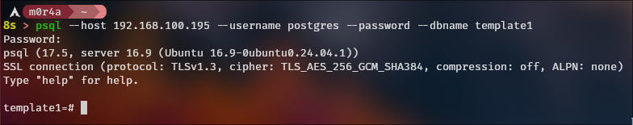

This is my write-up on how I install, configure, and manage `PostgreSQL` and `MySQL` databases.

For both tests I used Ubuntu Server and its [official documentation](https://documentation.ubuntu.com/server/how-to/databases/install-postgresql/)

# Table of Contents

- [PostgreSQL](#postgresql)
  - [Installation](#installation)
  - [Configuration](#configuration)
    - [Allowing external connections](#allowing-external-connections)
    - [Configuring the `postgres` user](#configuring-the-postgres-user)
    - [Fixing the port not opening issue](#fixing-the-port-not-opening-issue)
    - [Connecting to the database](#connecting-to-the-database)
    - [Creating a database and users](#creating-a-database-and-users)
    - [Memory and resource configuration](#memory-and-resource-configuration)
    - [Logging for monitoring](#logging-for-monitoring)
    - [Write-Ahead Log (WAL) configuration](#write-ahead-log-wal-configuration)
    - [Backup script](#backup-script)

# PostgreSQL

## Installation

Pretty basic, simply:

```bash
sudo apt install postgresql
```

## Configuration

### Allowing external connections

1. In my case, I'm creating the DB in a VM, so inside `/etc/postgresql/*/main/postgresql.conf` I'm going to add the IP of the bridge interface between the VM and my computer.

```
listen_addresses = 'localhost, 192.168.100.195'
```

2. And restart the service.

```bash
sudo systemctl restart postgresql
```

### Configuring the `postgres` user

1. Connect to the `template1` database as the postgres user.

```bash
sudo -u postgres psql template1
```

2. Now you need to change the user's password

```sql
ALTER USER postgres with encrypted password 'the_password';
```

3. Then you need to configure the `/etc/postgresql/*/main/pg_hba.conf` file

```
hostssl       template1  postgres  192.168.100.1/24  scram-sha-256
```

4. Restart the service:

```bash
sudo systemctl restart postgresql.service
```

> Here I added the `.service` - it can be used interchangeably unless there's something like postgresql.socket for example

### Fixing the port not opening issue

When trying to connect from my computer to the db I got an error. I went to the VM that has it and saw that the port wasn't opening even though I restarted the service. I verified this with:

```bash
ss -lntp | grep 5432
```

1. So I checked the service status

```bash
sudo systemctl status postgresql
```

And it says it's `Active (exited)` which means it executed a script and exited, so it's not the actual service running in the background.

2. I started reviewing the postgresql service logs

```bash
journalctl -u postgresql -e
```

But it didn't give me anything important:

```
Sep 03 01:38:25 db-server systemd[1]: Starting postgresql.service - PostgreSQL RDBMS...
Sep 03 01:38:25 db-server systemd[1]: Finished postgresql.service - PostgreSQL RDBMS.
Sep 03 01:40:55 db-server systemd[1]: postgresql.service: Deactivated successfully.
Sep 03 01:40:55 db-server systemd[1]: Stopped postgresql.service - PostgreSQL RDBMS.
Sep 03 01:40:55 db-server systemd[1]: Stopping postgresql.service - PostgreSQL RDBMS...
Sep 03 01:40:55 db-server systemd[1]: Starting postgresql.service - PostgreSQL RDBMS...
Sep 03 01:40:55 db-server systemd[1]: Finished postgresql.service - PostgreSQL RDBMS.
```

3. So I decided to check the service file directly to see if there was information

```bash
sudo systemctl cat postgresql
```

This is the most relevant part:

```
# The unit actually managing PostgreSQL clusters is postgresql@.service,
# instantiated as postgresql@15-main.service for individual clusters.
```

I checked `postgresql@` and there was nothing, I checked `postgresql@15-main` just to try and there was nothing, so I figured I should check `16-main`.

4. Finally I have information, this is what the command gave me:

```bash
sudo systemctl status postgresql@16-main
```

The important part is this:

```
CONTEXT:  line 19 of configuration file "/etc/postgresql/16/main/pg_hba.conf"
```

5. Conclusion

When configuring the postgres user in step 3, I should have removed the `[OPTIONS]`

### Connecting to the database

```bash
psql --host 192.168.100.195 --username postgres --password --dbname template1
```

<p align="center">
    
</p>

### Creating a database and users

1. Create the users

```sql
CREATE ROLE app_user WITH LOGIN PASSWORD 'a_password';
CREATE ROLE readonly_user WITH LOGIN PASSWORD 'secure_password';
```

2. Create the database

```sql
CREATE DATABASE app_db OWNER app_user;
```

3. Configure the permissions

```sql
GRANT CONNECT ON DATABASE app_db TO readonly_user;  -- Give permission to connect
GRANT USAGE ON SCHEMA public TO readonly_user;  -- Give permission to see the "public" schema
GRANT SELECT ON ALL TABLES IN SCHEMA public TO readonly_user;  -- Allow the user to make SELECT queries on the public schema
```

And with this we have the `app_user` user who owns the `app_db` database and the `readonly_user` user who has permission to read the `public` schema of the `app_user`'s database.

### Memory and resource configuration

In `/etc/postgresql/*/main/postgresql.conf`

```
# The VM that has the DB has 4GB of RAM
shared_buffers = '1GB'          # 25% of total RAM
effective_cache_size = '3GB'    # 50-75% of total RAM
work_mem = '8MB'
maintenance_work_mem = '256MB'
```

### Logging for monitoring

```
logging_collector = on
log_directory = 'log'
log_filename = 'postgresql-%Y-%m-%d_%H%M%S.log'
log_rotation_age = 1d
log_rotation_size = 100MB
log_line_prefix = '%m [%p] %q%u@%d '
log_min_duration_statement = 1000 
log_statement = 'ddl'
#log_statement = 'all'           # Only for development
```

### Write-Ahead Log (WAL) configuration

WAL is a logging system that helps with data durability and consistency. When there's a change in the database, this is written to a WAL file before actually being applied.

1. Create the directories:

```bash
sudo mkdir -p /var/lib/postgresql/archive
sudo chown postgres:postgres /var/lib/postgresql/archive
```

2. In `/etc/postgresql/*/main/postgresql.conf`

```
wal_level = replica
archive_mode = on
archive_command = 'cp %p /var/lib/postgresql/archive/%f'
max_wal_senders = 0
```

- `wal_level`
    - `minimal`: only contains what's necessary to recover after a crash. Doesn't allow PITR or replication.
    - `replica`: allows PITR and replication. This is the most common.
    - `logical`: has more detail and with this you can do **logical replication** (like replicating only certain tables).
- `archive_mode`
    - `off`: Doesn't archive WAL. Only crash recovery.
    - `on`: Archives WAL when **closing** segments (this is the standard).
    - `always`: Archives even segments used by streaming replicas. Useful if you need to **guarantee copies** without depending on replicas.
- `archive_command`:
    - This is the command that executes when a WAL segment is ready to be archived.
    - You can also use `rsync -a %p <path>/%f` instead of just cp.
- `max_wal_senders`:
    - This is the maximum number of processes that can send WAL to replicas.
    - Only important if there are standby servers.

So:

- If you only want **PITR without replicas** use:
    - `wal_level = replica`
    - `archive_mode = on`
    - `archive_command = (command that copies to a disk or storage)`

- If you need **logical replication** then:
    - `wal_level = logical`

- If you only require **basic crash recovery**:
    - `wal_level = minimal`
    - `archive_mode = off`

### Backup script

```bash
#!/bin/bash
# /usr/local/bin/pg_backup.sh

# If any command fails, the whole script fails
set -euo pipefail

# Configuration
BACKUP_DIR="/var/backups/postgresql"
DATE=$(date +%Y%m%d_%H%M%S)
RETENTION_DAYS=7
LOG_FILE="/var/log/pg_backup.log"
DB_USER="postgres"

log() {
    echo "[$(date '+%Y-%m-%d %H:%M:%S')] $1" | tee -a "$LOG_FILE"
}

# Create necessary directories if they don't exist
mkdir -p "$(dirname "$LOG_FILE")"
mkdir -p "$BACKUP_DIR"

log "Starting PostgreSQL backup"

# Make the backup with compression
BACKUP_FILE="$BACKUP_DIR/full_backup_$DATE.sql.gz"

if pg_dumpall -U "$DB_USER" | gzip > "$BACKUP_FILE"; then

    chmod 600 "$BACKUP_FILE"

    # verify if the file was created and has content
    if [[ -s "$BACKUP_FILE" ]]; then
        BACKUP_SIZE=$(du -h "$BACKUP_FILE" | cut -f1)
        log "Backup completed successfully: $BACKUP_FILE ($BACKUP_SIZE)"
        
        # Clean up old backups
        DELETED=$(find "$BACKUP_DIR" -name "*.sql.gz" -mtime +$RETENTION_DAYS -delete -print | wc -l)
        log "Old backups deleted: $DELETED"
    else
        log "ERROR: The backup file is empty or was not created"
        exit 1
    fi
else
    log "ERROR: pg_dumpall command failed"
    exit 1
fi

log "Backup process completed"
```

#### Script considerations:

1. The script permissions should be as follows:

```bash
chmod 700 /usr/local/bin/pg_backup.sh
chown postgres:postgres /usr/local/bin/pg_backup.sh
```

Since if a script that's in the crontab gets compromised, things can be executed on behalf of the user running that job.

2. You should configure an authentication method, either a `.pgpass`

```bash
# Create the file and its content
sudo mkdir -p /etc/postgresql/auth
sudo cat > /etc/postgresql/auth/.pgpass << 'EOF'
localhost:5432:selected_db:postgres:password
EOF

sudo chmod 600 /etc/postgresql/auth/.pgpass
sudo chown postgres:postgres /etc/postgresql/auth/.pgpass

# Configure password file in the postgres user's .bashrc
export PGPASSFILE="/etc/postgresql/auth/.pgpass"
```

Or modify the `pg_hba.conf` to allow authentication by system user:

```
local all postgres peer
```

3. This script is designed to be executed by the `postgres` user

```bash
sudo -u postgres crontab -e
```

And the entry is as follows:

```
# Backups Monday, Wednesday and Friday
0 2 * * 1,3,5 /usr/local/bin/pg_backup.sh
```

4. This can be more complete, sending emails if the backup fails and so on, but I don't want to make this README 1300 lines long.
